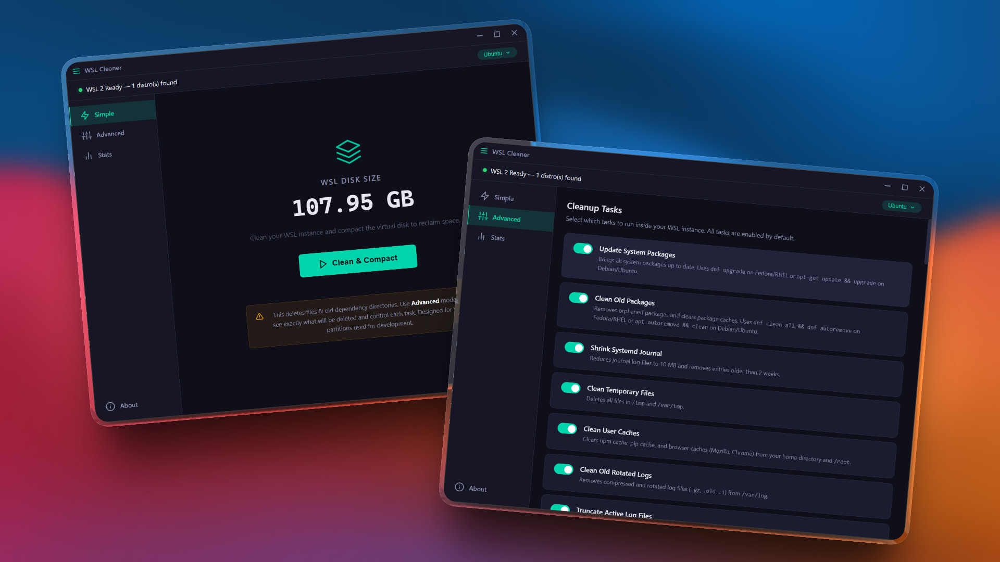

# WSL Cleaner

> **WARNING: This tool permanently deletes files inside your WSL distribution.** It is designed for developers who understand what is being removed. Deleted files include caches, logs, build artifacts, and other regenerable data -- but once removed they are gone. **Use Advanced mode first** to review exactly what each task does before running Simple mode. Always ensure you have backups of anything important. The authors are not responsible for any data loss.

Designed for developers who use Windows 10/11 with WSL2, and have large WSL2 volumes that need cleaning and compacting. Can often save 10-100+ GB of space on your SSD.

[](https://github.com/dbfx/wsl-cleaner/releases)

[](LICENSE)



## Features

### Simple Mode
One-click "Clean & Compact" that runs all non-aggressive cleanup tasks, removes stale directories, runs filesystem TRIM, and compacts your virtual disk automatically. Shows before/after disk size comparison.

### Advanced Mode
Full control over individual cleanup tasks with toggles, a stale directory scanner with configurable age threshold, and manual disk compaction with automatic TRIM.

### Cleanup Tasks

#### System
- **Update System Packages** -- `apt-get update && upgrade` or `dnf upgrade` (auto-detects distro)
- **Clean Old Packages** -- `apt autoremove && clean` or `dnf clean all && autoremove`
- **Shrink Systemd Journal** -- vacuum logs to 10 MB / 2 weeks
- **Clean Temporary Files** -- clear `/tmp` and `/var/tmp`
- **Clean Old Rotated Logs** -- remove `.gz`, `.old`, `.1` files from `/var/log`
- **Truncate Active Log Files** -- empty syslog and `*.log` files without deleting
- **Clean Apt Package Lists** -- remove cached package lists (Debian/Ubuntu)
- **Clean Snap Cache** -- remove cached snap packages
- **Clean Core Dumps & Crash Reports** -- clear `/var/crash` and `/var/lib/systemd/coredump`
- **Remove Old Kernel Packages** -- purge unused `linux-image`, `linux-headers`, `linux-modules` (Debian/Ubuntu)
- **Clean Font Cache** -- clear fontconfig caches (rebuilt on demand)
- **Clean Database Logs** -- remove MySQL/MariaDB and PostgreSQL log files
- **Filesystem TRIM** -- `fstrim` (or zero-fill fallback) to make VHDX compaction dramatically more effective

#### User & Editor
- **Clean User Caches** -- npm, pip, Mozilla, and Chrome caches
- **Clean VS Code / Cursor / Windsurf Server** -- extension caches and logs (preserves extensions and settings)
- **Empty Trash** -- clear `~/.local/share/Trash`
- **Clean Thumbnail Cache** -- remove `~/.cache/thumbnails`
- **Clean Vim/Neovim Swap & Undo Files** -- swap, undo, and shada files
- **Clean Shell Completion Caches** -- Zsh compdumps, oh-my-zsh cache, Zsh sessions
- **Clean Jupyter Runtime Files** -- leftover kernel connection files
- **Clean Kubernetes & Helm Cache** -- kubectl and Helm chart caches

#### Package Manager Caches
- **Clean Yarn Cache** -- `yarn cache clean`
- **Clean pnpm Store** -- `pnpm store prune`
- **Clean Go Module Cache** -- `go clean -modcache`
- **Clean Cargo/Rust Registry Cache** -- `~/.cargo/registry` caches
- **Clean Pip Cache Directory** -- `~/.cache/pip`
- **Clean Composer Cache** -- PHP Composer download cache
- **Clean Maven Cache** -- `~/.m2/repository` (can be 5-15 GB)
- **Clean Gradle Cache** -- `~/.gradle/caches` and wrapper distributions
- **Clean Conda Cache** -- unused packages, tarballs, and downloads
- **Clean Ruby Gems Cache** -- `gem cleanup` and cached gem files
- **Clean NuGet Cache** -- .NET NuGet package caches
- **Clean Deno Cache** -- cached remote modules and compiled files
- **Clean Bun Cache** -- `~/.bun/install/cache`
- **Clean Dart/Flutter Pub Cache** -- `~/.pub-cache`
- **Clean Homebrew/Linuxbrew Cache** -- old downloads and formula
- **Clean ccache** -- C/C++ compiler cache
- **Clean Bazel Cache** -- `~/.cache/bazel` (can be 10+ GB)

#### Framework & Project
- **Clean Laravel Logs & Cache** -- finds Laravel projects and clears `storage/logs`, `storage/framework/cache/data`, and compiled views
- **Clean Framework Build Caches** -- finds and removes `node_modules/.cache`, `.next/cache`, `.angular/cache`, `.svelte-kit`, `.nuxt` caches, `.parcel-cache`, `.turbo`, and `.tsbuildinfo` files
- **Clean Docker Dangling Artifacts** -- removes only dangling images, unused networks, and stale build cache (all named images, containers, and volumes are preserved)
- **Compact Git Repositories** -- finds all repos under `/home` and runs `git reflog expire --expire=now --all` + `git gc --prune=now --aggressive` (branches, tags, and reachable commits are untouched; reflog recovery history is lost)

#### Aggressive (off by default)
These tasks are disabled by default and marked with an orange "aggressive" badge in the UI. Enable them manually in Advanced mode if you understand the trade-offs.

- **Clean All User Caches** -- blanket `~/.cache/*` removal (may break active app sessions)
- **Remove Man Pages & Docs** -- deletes `/usr/share/man`, `/usr/share/doc`, `/usr/share/info` (saves 200-400 MB; regenerated on package reinstall)
- **Remove Unused Locales** -- removes all non-English locale data from `/usr/share/locale` (saves 100+ MB; do not use if you need non-English locales)

### Stale Directory Scanner
Finds old dependency, build, and cache directories that haven't been modified in a configurable number of days. Review and delete them individually or in bulk. Scans for:

`node_modules`, `vendor`, `__pycache__`, `.next`, `.nuxt`, `.turbo`, `.yarn`, `target`, `.gradle`, `.tox`, `.pytest_cache`, `.mypy_cache`, `dist`, `.parcel-cache`, `.cache`, `.venv`, `venv`, `elm-stuff`, `.terraform`, `.serverless`, `.nx`

### Health Dashboard
Real-time system metrics for your WSL distributions, turning the app into a lightweight WSL management tool. Auto-refreshes every 10 seconds while active. Monitors:

- **Core metrics:** kernel version, distro OS, uptime, CPU load, memory/swap usage with visual bars
- **Disk & I/O:** filesystem usage bar, I/O pressure (some/full)
- **Networking:** interface RX/TX stats, listening ports table, DNS resolution status (green/red indicator)
- **Processes:** top 20 by CPU, zombie process detection with count badge
- **Services:** Docker container counts (running/stopped), systemd state with failed unit listing
- **System info:** installed package count, GPU/CUDA availability, WSL interop status
- **WSL config:** reads `.wslconfig` memory/swap limits and displays alongside actual usage

### Distro Manager
Centralized control panel for all your WSL distributions. Features include:

- **Comparison table** showing every distro's state, OS, VHDX size, installed package count, and uptime side by side
- **Export** any distro to a `.tar` backup with a file picker
- **Import** a distro from a `.tar` archive, choosing name and install location
- **Clone** a distro in one click (export + import under a new name)
- **One-click restart** — terminates and re-launches a distro instantly
- Auto-refreshes every 15 seconds while the page is active

### Disk Map (Treemap Visualizer)
Interactive treemap (WinDirStat-style) that shows exactly what's consuming space inside your WSL filesystem. Runs `du` in the background, renders a clickable chart with drill-down navigation and breadcrumbs. Automatically excludes Windows mounts (`/mnt`).

### Disk Compaction
Runs filesystem TRIM, shuts down WSL, updates it, then compacts the VHDX virtual disk using `Optimize-VHD` (with automatic UAC elevation). Reports space saved.

### Tool Auto-Detection
The app auto-detects which tools are installed in your WSL distribution and only shows relevant cleanup tasks. Detected tools:

`apt`, `dnf`, `npm`, `yarn`, `pnpm`, `go`, `pip`, `pip3`, `composer`, `snap`, `docker`, `mvn`, `gradle`, `conda`, `gem`, `dotnet`, `deno`, `bun`, `dart`, `brew`, `ccache`, `bazel`

### Distro Support
- **Debian/Ubuntu** -- uses `apt`
- **Fedora/RHEL** -- uses `dnf`
- Automatically skips Docker Desktop internal distros

## Requirements

- Windows 10 or 11
- WSL 2 with at least one installed distribution
- Hyper-V enabled (required for `Optimize-VHD` disk compaction)

## Download

Grab the latest installer from [GitHub Releases](https://github.com/dbfx/wsl-cleaner/releases).

## Development

### Prerequisites

- [Node.js](https://nodejs.org/) (v18 or later recommended)
- npm (comes with Node.js)

### Setup

```bash
git clone https://github.com/dbfx/wsl-cleaner.git
cd wsl-cleaner
npm install
```

### Run

```bash
npm start
```

### Build

To create a Windows installer:

```bash
npm run build
```

The installer will be output to the `dist/` directory.

## Project Structure

```
wsl-cleaner/
  main.js              # Electron main process — IPC handlers, auto-updater
  preload.js           # Secure bridge (contextBridge → window.wslCleaner)
  cli.js               # Standalone CLI (node cli.js --help)
  lib/
    wsl-ops.js         # WSL commands, VHDX discovery, stale scanning, health info, distro management
    utils.js           # Pure helpers — parseWslOutput, friendlyError, etc.
    stats-db.js        # Cleanup history persistence (JSON)
    preferences.js     # Task toggle & locale preference persistence
  renderer/
    index.html         # App shell with data-i18n attributes
    app.js             # UI logic, state management, task orchestration
    tasks.js           # TASKS array (40+ cleanup task definitions)
    treemap.js         # Squarified treemap algorithm & DOM renderer
    i18n.js            # Lightweight i18n runtime (t, tp, tError, applyI18n)
    utils.js           # formatBytes, escapeHtml, estimateTotalSize
    styles.css         # Dark-mode stylesheet
  locales/
    en.json            # Source-of-truth English strings
    languages.json     # Language registry (code, name, nativeName)
    *.json             # Translated locale files (fr, de, es, zh, hi, pt)
  scripts/
    translate.js       # OpenAI-powered translation generator
    release.js         # Version bump helper
  tests/               # Vitest test suite
  assets/              # App icons (icon.png, icon.ico)
  package.json         # Dependencies and electron-builder config
```

## License

[MIT](LICENSE)
